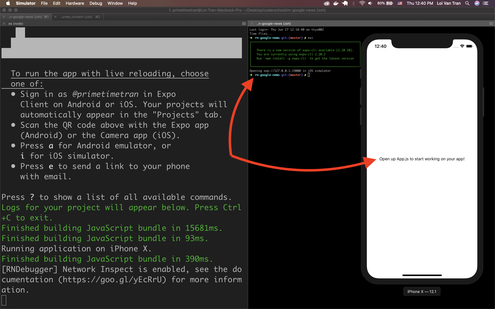
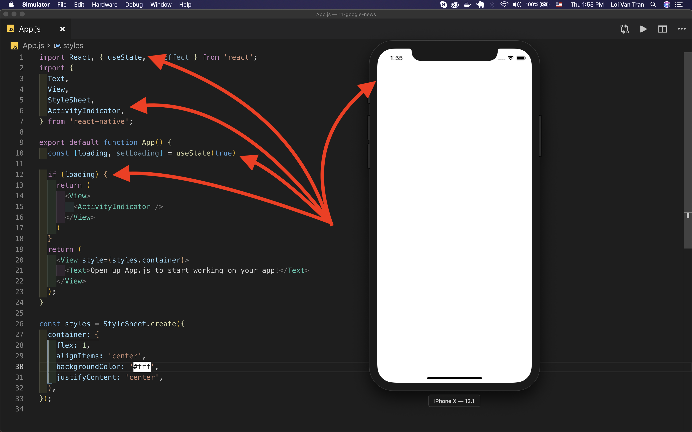
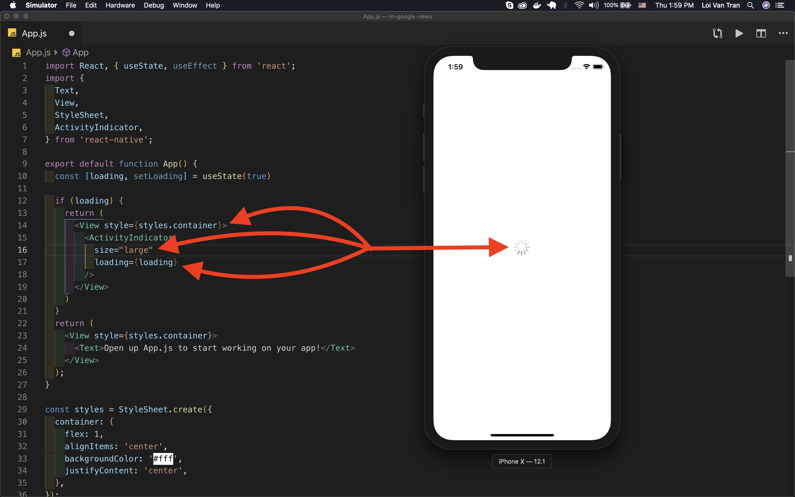
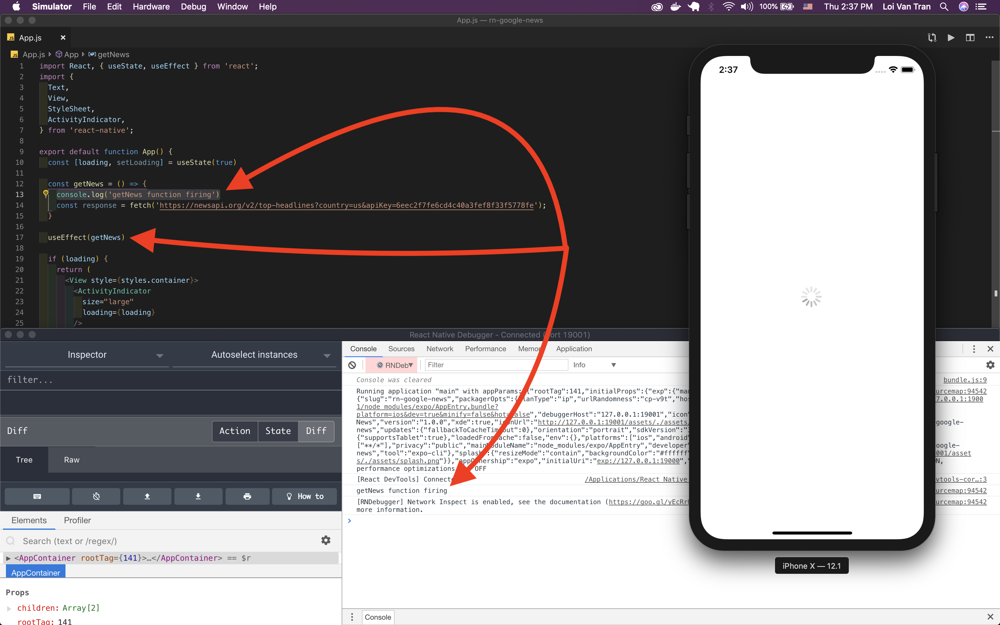
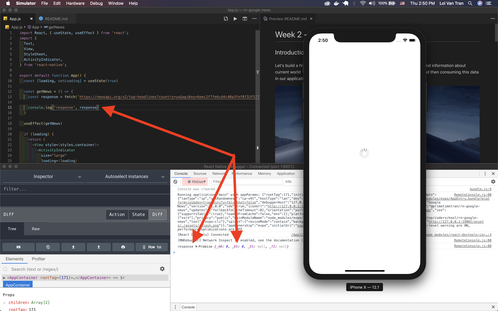
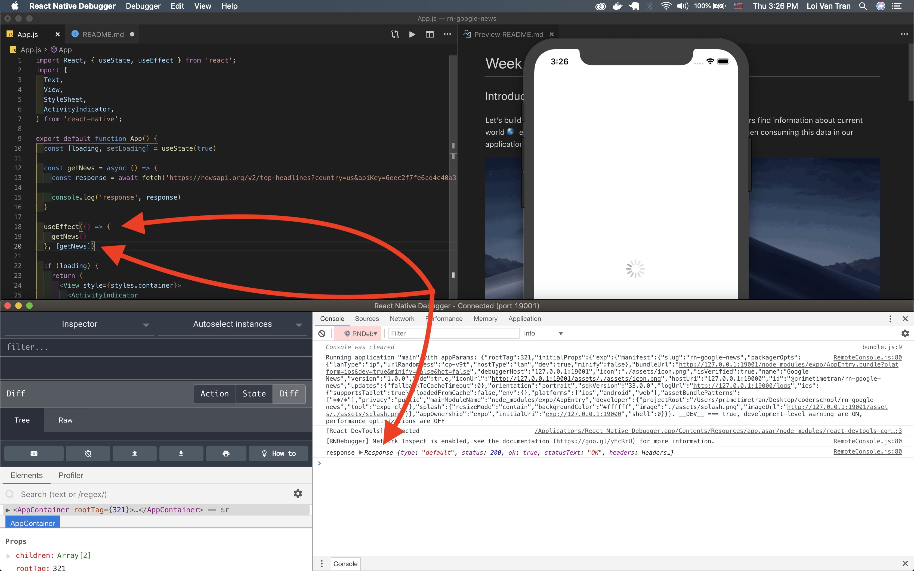
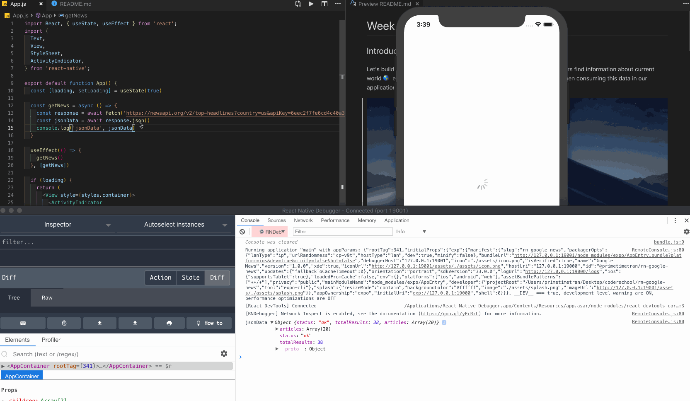
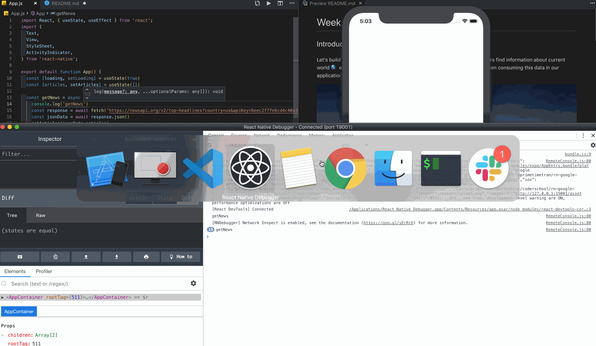
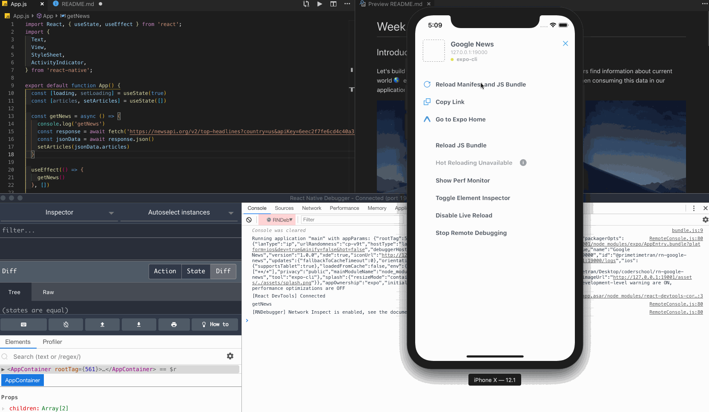
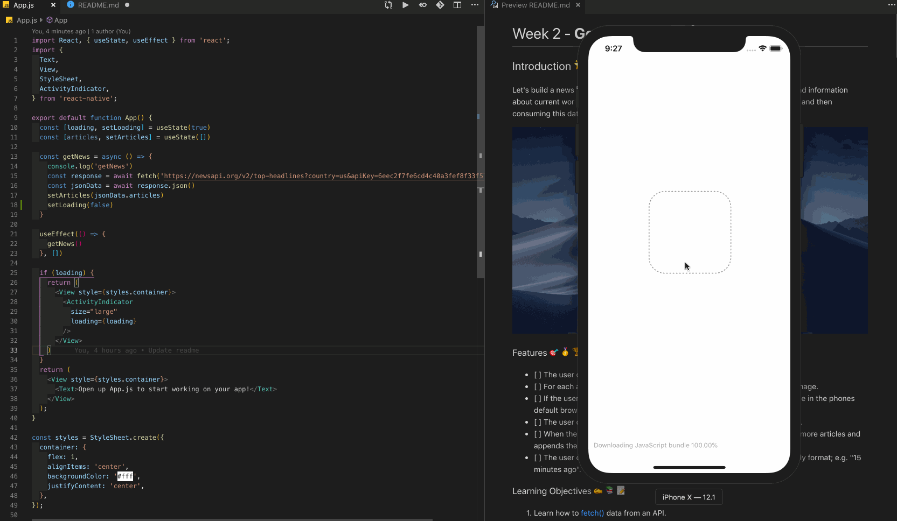

# Week 5 - **Google News 📰 🗞️**

## Introduction 🌟

Let's build a news 📰 app 📱 using [React Native](https://facebook.github.io/react-native/) & [Expo](https://expo.io/).  Our app will help users find information about current world 🌎 events. We'll do so by requesting data from a 3rd party API and then consuming this data in our application.


### Features 🎯🥇🏆

- [ ] The user can see a list of news articles loaded from an API.
- [ ] For each article the user sees a title, source, link to read more, and hero image.
- [ ] If the user pushes the "read more" button then the app opens up the article in the phones default browser.
- [ ] The user can see the total number of articles they've fetched from the API.
- [ ] When the user scrolls to the end of the list, the app automatically fetches more articles and appends them to the list of current articles(adds).
- [ ] The user can see how long ago the story was published in a human-friendly format; e.g. "15 minutes ago".

### Learning Objectives ✍️📚📝 ️

1. Learn how to [fetch()](https://scotch.io/tutorials/how-to-use-the-javascript-fetch-api-to-get-data) data from an API.
    - Recognize the fetch function **takes time**. It'll also require the use of new functions we haven't seen before.
    - `fetch()` - The **1st** argument is the [api endpoint](https://stackoverflow.com/questions/2122604/what-is-an-endpoint) we're fetching data from, the **2nd** [options](https://developer.mozilla.org/en-US/docs/Web/API/Fetch_API/Using_Fetch#Supplying_request_options)
    - `json()` - Used to **parse to JS** object.

2. Learn what `async` & `await` are used for. [Read more detailed async & await](https://alligator.io/js/async-functions/).
    - Recognize they're used to make asynchronous.
      - `async` - Tells JS that a function is **asynchronous**.
      - `await` - Tells JS that this line will **take a few moments**.

3. Learn what `try` & `catch` are used for.
    - Recognize they're when we need to be careful because our code may fail.
    An example is an api request. There are other [use cases](https://www.w3schools.com/java/java_try_catch.asp).

4. Learn what an open source library is and how to use them in our work.
    - Recognize [React Native Elements](https://github.com/react-native-training/react-native-elements) & [Moment](https://momentjs.com/docs/) are two of millions of free libraries publically available through [npm](https://www.npmjs.com/).

5. Learn how to render `n` items to the screen efficiently.
    - Recognize this is such a common requirement that React Native provides the component [FlatList](https://facebook.github.io/react-native/docs/flatlist) for this usecase.

> **Tip** 💡: Almost all apps use data fetched from an API. Work slowly through this lab to make sure you understand each step and why they're required.

### **Milestone 1 🛣🏃 Set up initial state of loading**

Let's indicate to the user something's happening. Show a spinner on app load because we haven't gotten our data(news articles) yet and will immediately be fetching it.

**A)**  Use `expo init` to create your project. I'm calling mine `rn-google-news`.



**B)** Import the required functions from React that can add statefulness to our app.

```jsx
import React, { useState, useEffect } from 'react';
```

**C)** Import the `ActivityIndicator` component.

```jsx
import {
  ActivityIndicator,
} from 'react-native';
```

**D)** Define the `loading` variable/state, `setter` method, and initial value of `loading` in the `App` component's body as `true`.

```jsx
const [loading, setLoading] = useState(true)
```

**E)** Add a conditional to `App` which returns the `ActivityIndicator` in the event the app's state is `loading`.

```jsx
if (loading) {
  return (
    <View>
      <ActivityIndicator />
    </View>
  )
}
```



**F)** Add style and pass the `loading` state to our `ActivityIndicator`'s `loading` prop. This will determine whether or not the spinner should spin.

```jsx
<View style={styles.container}>
  <ActivityIndicator 
    size="large"
    loading={loading}
  />
</View>
```



We should now see that there's a spinner when the app loads. Excellent.

---
> Key Points 🔑📝

- Indicating to the user we're working on their behalf provides a nice experience.
- `ActivityIndicator` provided by React Native is a component which looks like a spinner.

---

### **Milestone 2 🛣🏃 Request data from the API**
Now we need to get the news articles data. We'll do so by using a combination of Javascript's `fetch`, `try`, `catch`, `async`, & `await` functions.

**A)** Get required api key.

Create an account [here](https://newsapi.org/s/google-news-api) to get the free api key we'll need. The api key will look something like this:

```js
  9eec2f7fe6cd4c40a3fef8f33f5778fa
```

**B)** Fetch the required data.

1. Define a function which will request the data we need. I'll call it `getNews`.

```jsx
const getNews = () => {
  // ... code soon ...
}
```

2. Use JS's `fetch` method in the body of this function to request data from the appropriate endpoint.
The argument this function takes is the URL endpoint we want to get data from. You'll also neeed to pass the `apiKey` that you got in the previous step as a parameter to this request.

```jsx
const getNews = () => {
  const response = fetch('https://newsapi.org/v2/top-headlines?country=us&apiKey=6eec2f7fe6cd4c40a3fef8f33f5778fe');
}
```

3. Fire the `getNews` function when the component mounts by passing it to `useEffect()`. Add a `console.log` to the body of `getNews` to confirm.

```jsx
useEffect(getNews)
```

```jsx
const getNews = () => {
  console.log('getNews function firing')
  // ... code ...
}
```



You should now see what you console.logged in your debugging console.

**C)** Checkout the data we got from the api request by console.logging the `response`.



You should see something like this in your console. This is called a [Promise](https://javascript.info/promise-basics). Promises can become [much more complicated](https://medium.com/javascript-scene/master-the-javascript-interview-what-is-a-promise-27fc71e77261).

#### For now, just understand that a promise is data that we will soon have

Because the `fetch` request takes **some amount of time** before it completes, our `getNews` function is constitutes what is known as an [asynchronous function](https://stackoverflow.com/questions/4559032/easy-to-understand-definition-of-asynchronous-event).

`Asynchronous` functions are so common that JS provides us a technique to handle them as if they were synchronous.

**D)** Add `async` & `await` to our function definition to handle the `Promise`.

```jsx
const getNews = async () => {
  // ... code ...
  const response = await fetch('https://newsapi.org/v2/top-headlines?country=us&apiKey=6eec2f7fe6cd4c40a3fef8f33f5778fe');
  
}
```

#### You should now see complains on the simulator & console



```chrome
An Effect function must not return anything besides a function, which is used for clean-up.
```

**E)** Update our `useEffect()` function call to get rid of this warning. If you want to be an advanced React dev one day, read more [here](https://overreacted.io/a-complete-guide-to-useeffect/).

```jsx
useEffect(() => {
  getNews()
}, [])
```


Now we'll see that the complaint from React goes away.

We've almost got the data we need. We just need to do one more step.

**F)** Use `json()` to parse the **JSON** response to a **JS** object. Add another `await` because response is a Promise and we need to wait for it before calling `json()`

```jsx
const getNews = async () => {
  // ... code ...
  const jsonData = await response.json()
}
```

### You should now be able **expand** the `jsonData` object and view it's shape



**G)** Define a new piece of state, `articles`, to hold the data we get from the API. We **choose** to set it's initial state to an empty array because we want to maintain a **consistent datatype**.

```jsx
const [articles, setArticles] = useState([])
```

**H)** Refactor `getNews` to set the state with the articles we get from the api.

```jsx
const getNews = async () => {
  // ... code ...
  setArticles(jsonData.articles)
}
```

You'll now see that now we're causing an [infinite loop](https://en.wikipedia.org/wiki/Infinite_loop), our request continuously fires.



The reason this is occuring is because our hook fires when the component mounts, afterwards it updates state. The result of an update to our component's state is that our hook fires again; thus, the infinite loop.

**I)** Update the `useEffect()` to **not cause** the infinite loop.

```jsx
useEffect(() => {
  getNews()
}, [])
```

We should now see that the `getNews` logs in the console once, indicating that the function only fired once; excellent!



**J)** Hide the spinner when the data is fetched by setting our loading state to false.

```jsx
const getNews = async () => {
  // ... code ...
  setLoading(false)
}
```


We should now see that the `ActivitySpinner` displays for a few moments while the API request is going on, then hides when complete. This is a visual indicator that we have our data, *excellent*.

---
> Key Points 🔑📝

- Making a request to an api takes time.
- Some of the keywords involved are `async`, `await`, `fetch()`, & `json()`.

---

### **Milestone 3 🛣🏃 Render news article data to the screen**

**A)** Stop your packager & simulator and install two new packages using `npm`.

```jsx
npm install react-native-elements moment
```


