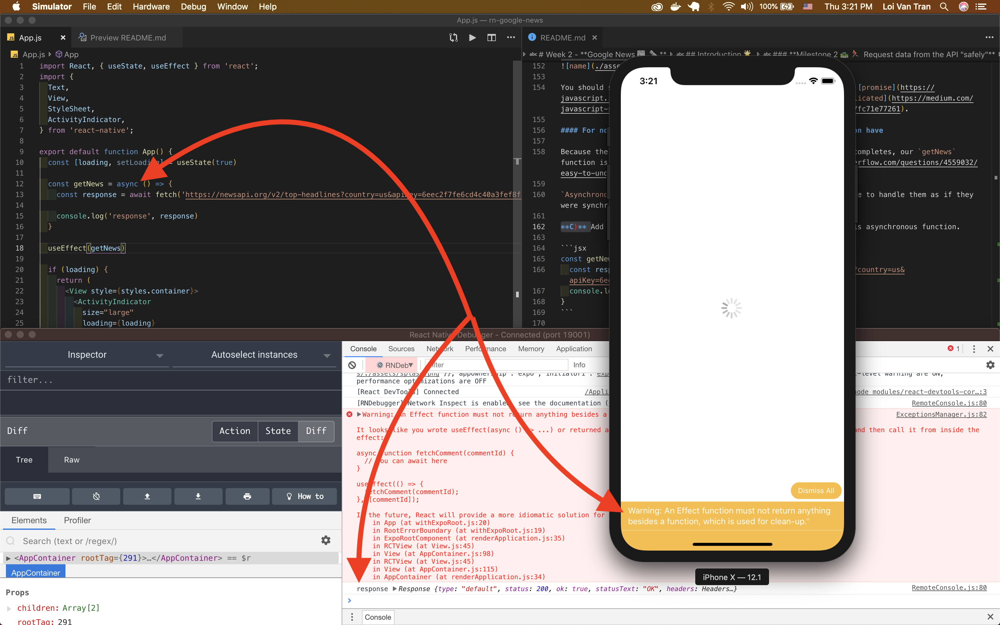

# Week 2 - **Google News 📰 🗞️**

## Introduction 🌟

Let's build a News app 📱 using [React Native](https://facebook.github.io/react-native/) & [Expo](https://expo.io/).  Our app will help users find information about current world 🌎 events. We'll do so by requesting data from a 3rd party API and then consuming this data in our application.


### Features 🎯🥇🏆

- [ ] The user can see a list of news articles loaded from an API.
- [ ] For each article the user sees a title, source, link to read more, and hero image.
- [ ] If the user pushes the "read more" button then the app opens up the article in the phones default browser.
- [ ] The user can see the total number of articles they've fetched from the API.
- [ ] When the user scrolls to the end of the list, the app automatically fetches more articles and appends them to the list of current articles(adds).
- [ ] The user can see how long ago the story was published in a human-friendly format; e.g. "15 minutes ago".

### Learning Objectives ✍️📚📝 ️

1. Learn how to `fetch` data from an API. [Detailed explanation](https://www.robinwieruch.de/react-fetching-data/).
    - Recognize that it requires a few steps. `async`, `await`, `fetch()`, and `json()`.

2. Learn what `async` & `await` are used for.
    - Recognize they're used to make asynchronous.
      - [Read more about asynchronous functions](https://alligator.io/js/async-functions/).

3. Learn what `try` & `catch` are used for.
    - Recognize they're used to handle failures in API requests.

4. Learn what an open source library is and how to use them in our work.
    - Recognize **React Native Elements** & **Moment** are two of millions of free libraries publically available.

5. Learn how to render `n` items to the screen efficiently.
    - Recognize this is such a common requirement that React Native provides the component `FlatList` for this usecase.

> **Tip** 💡: Almost all apps use data fetched from an API. Work slowly and think about the implications of each step.

### **Milestone 1 🛣🏃 Set up initial state of loading**

Let's indicate to the user something's happening. Show a spinner on app load because we haven't gotten our data(news articles) yet and will immediately be fetching it.

**A)**  Use `expo init` to create your project. I'm calling mine `rn-google-news`.


**B)** Import the required functions from React that can add statefulness to our app.

```jsx
import React, { useState, useEffect } from 'react';
```

**C)** Import the `ActivityIndicator` component.

```jsx
import {
  ActivityIndicator,
} from 'react-native';
```

**D)** Define the `loading` variable, `setter` method, and initial value of `loading` in the `App` component's body as `true`.

```jsx
const [loading, setLoading] = useState(true)
```

**E)** Add a conditional to `App` which returns the `ActivityIndicator` in the event the app's state is `loading`.

```jsx
if (loading) {
  return (
    <View>
      <ActivityIndicator />
    </View>
  )
}
```


**F)** Add style and pass the `loading` state to our `ActivityIndicator`'s `loading` prop. This will determine whether or not the spinner should spin.

```jsx
<View style={styles.container}>
  <ActivityIndicator 
    size="large"
    loading={loading}
  />
</View>
```


We should now see that there's a spinner when the app loads. Excellent.

---
> Key Points 🔑📝

- Indicating to the user we're working on their behalf provides a nice experience.
- `ActivityIndicator` provided by React Native is a component which looks like a spinner.

---

### **Milestone 2 🛣🏃 Request data from the API "safely"**
Now we need to get the news articles data. We'll do so by using a combination of Javascript's `fetch`, `try`, `catch`, `async`, & `await` functions.

**A)** Get required api key.

Create an account [here](https://newsapi.org/s/google-news-api) to get the free api key we'll need. The api key will look something like this:

```js
  9eec2f7fe6cd4c40a3fef8f33f5778fa
```

**B)** Fetch the required data.

1. Define a function which will request the data we need. I'll call it `getNews`.

```jsx
const getNews = () => {
  // ... code ...
}
```

2. Use JS's `fetch` method in the body of this function to request data from the appropriate endpoint.
The argument this function takes is the URL endpoint we want to get data from. You'll also neeed to pass the `apiKey` that you got in the previous step as a parameter to this request.

```jsx
const getNews = () => {
  const response = fetch('https://newsapi.org/v2/top-headlines?country=us&apiKey=6eec2f7fe6cd4c40a3fef8f33f5778fe');
}
```

3. Fire the `getNews` function when the component mounts. I advise adding `console.log` to it's body to confirm our expectations. We need to call `useEffect()` with the function we want to fire on app load, `getNews`.

```jsx
useEffect(getNews)
```

```jsx
const getNews = () => {
  console.log('getNews function firing')
  const response = fetch('https://newsapi.org/v2/top-headlines?country=us&apiKey=9eec2f7fe6cd4c40a3fef8f33f5778fa');
}
```


You should now see what you console.logged in your debugging console.

**B)** Checkout the data we got from the `fetch` request by console.logging the `response` you get back from the API.


You should see something like this in your console. This is called a [promise](https://javascript.info/promise-basics). Promises can become [much more complicated](https://medium.com/javascript-scene/master-the-javascript-interview-what-is-a-promise-27fc71e77261).

#### For now, just understand that a promise is data that we will soon have

Because the `fetch` request takes **some amount of time** before it completes, our `getNews` function is classified as an [asynchronous function](https://stackoverflow.com/questions/4559032/easy-to-understand-definition-of-asynchronous-event).

`Asynchronous` functions are so common that JS provides us a technique to handle them as if they were synchronous.

**C)** Add `async` & `await` to our function definition to handle this asynchronous function.

```jsx
const getNews = async () => {
  console.log('getNews function firing')
  const response = await fetch('https://newsapi.org/v2/top-headlines?country=us&apiKey=6eec2f7fe6cd4c40a3fef8f33f5778fe');
  console.log('response', response)
}
```

You should now see this complaint despite the fact we got our data.

```chrome
An Effect function must not return anything besides a function, which is used for clean-up.
```


**D)** Update our `useEffect()` function call.

```jsx
useEffect(() => {
  getNews()
}, [getNews])
```



Now we'll see that the complaint from React goes away. This is a advanced concept we'll skip for now but it will probably useful for you to understand it in the future. Read more [here](https://overreacted.io/a-complete-guide-to-useeffect/).

**E)** Use `json()` to parse the response. Add another `await` because response is a promise which we need to wait on!

```jsx
const getNews = async () => {
  console.log('getNews function firing')
  const response = await fetch('https://newsapi.org/v2/top-headlines?country=us&apiKey=6eec2f7fe6cd4c40a3fef8f33f5778fe');
  const jsonData = await response.json()
  console.log('jsonData', jsonData)
}
```

#### You should now be able expand the `jsonData` object and view it's shape


**F)** Define a new piece of state, `articles`, to hold the data we get from the API. It's initial state is an empty array because it will eventually hold an array of data and we should make sure the datatype is consistent.

```jsx
const [articles, setArticles] = useState([])
```

**G)** Refactor `getNews` to set the state of articles once the request has succedded.

```jsx
const getNews = async () => {
  console.log('getNews')
  const response = await fetch('https://newsapi.org/v2/top-headlines?country=us&apiKey=6eec2f7fe6cd4c40a3fef8f33f5778fe');
  const jsonData = await response.json()
  setArticles(jsonData.articles)
}
```

You'll now see that now we're causing an [infinite loop](https://en.wikipedia.org/wiki/Infinite_loop), our request continuously fires.


The reason this is occuring is because our hook fires when the component mounts, afterwards it updates state. The result of an update to our component's state is that our hook fires again; thus, the infinite loop.

**G)** Update the `useEffect()` to **not cause** the infinite loop.

```jsx
useEffect(() => {
  getNews()
}, [])
```

We should now see that the `getNews` console.log only fires once, indicating that the function only fired once, excellent!


## Review 💻🤓🤔

- All components require some properties. The properties will be of many different shapes, many different data types 🍚🥦🍗🌶.

- We can build 🏗👷our own components to take props **easily**. These props will influence our component's behavior. Some of the props we passed were:
  - `to="vnd"`
  - `from="usd"`
  - `toCurrency={toCurrency}`
  - `fromCurrency={fromCurrency}`
  - `setConversionCurrencies={setConversionCurrencies}`
  - `type={fromCurrency}`
  - `value={currentCurrencyValue}`

- We can add state to our application if we're familiar with `useState`.
  - `useState` is a function.
  - The return value is an array
  - `useState('Hello World')` would result in `'Hello World'` being the default state.
  - The first index is the state variable.
  - The second is known as a `setter` function/method.
- `useEffect()` is used to apply state changes.
  - In other words, run this code after state has changed.

### Accomplishments 🎯🥇🏆💯


### Rockets 🚀

- [ ] User can convert from USD to EURO.
- [ ] User can convert from EURO to USD.
- [ ] User can convert from VND to EURO.
- [ ] User can convert from EURO to VND.
